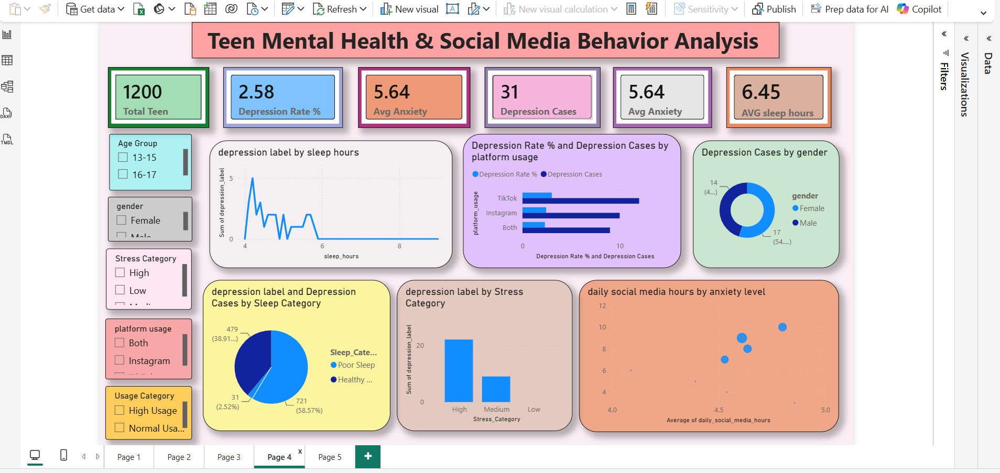

# 🧠 Teen Mental Health & Social Media Analysis Dashboard

---

# 📌 Project Overview

Teen mental health has become a growing concern due to increasing stress, anxiety, poor sleep habits, and excessive social media usage.

This project leverages Power BI to analyze behavioral and psychological factors affecting adolescent mental health and identify patterns associated with depression risk.

The dashboard transforms raw data into actionable insights that can help schools, parents, and mental health professionals make informed decisions and promote early intervention strategies.

---

# 🎯 Problem Statement

Teenagers face rising stress, poor sleep, anxiety, and excessive social media usage, increasing the risk of mental health issues and emotional instability.

The objective of this project is to identify the key behavioral factors contributing to depression risk and provide actionable recommendations through interactive data visualization.

---

# 🛠 Tools & Technologies

- Power BI
- Power Query
- DAX
- Microsoft Excel
- Data Visualization
- Exploratory Data Analysis (EDA)

---

# 📂 Dataset Information

The dataset contains information related to:

- Age
- Gender
- Social Media Usage
- Sleep Hours
- Stress Levels
- Anxiety Levels
- Platform Usage
- Depression Indicators

---

# 🧹 Data Cleaning & Transformation

The following data preparation steps were performed:

✔ Removed duplicates

✔ Handled missing values

✔ Corrected data types

✔ Created custom categories

✔ Feature engineering using Power Query

### Custom Columns Created

- Age Group
- Sleep Category
- Stress Category

---

# 📊 Key Performance Indicators (KPIs)

The dashboard includes:

- Total Teenagers
- Depression Cases
- Depression Rate (%)
- Average Sleep Hours
- Average Anxiety Level
- Average Stress Level

---

# 📈 Dashboard Analysis

### Demographic Analysis
- Gender Distribution
- Age Group Analysis

### Mental Health Analysis
- Depression Trends
- Anxiety Analysis
- Stress Analysis

### Behavioral Analysis
- Sleep Pattern Analysis
- Social Media Usage Analysis
- Platform-wise Comparison

### Interactive Filtering
- Gender
- Stress Category
- Sleep Category
- Platform Usage

---

# 🔍 Key Insights

### 1. Poor Sleep is the Biggest Mental Health Risk Factor
Teenagers with poor sleep habits show significantly higher mental health vulnerability.

### 2. High Stress Students Show Greater Mental Health Risk
Students experiencing high stress exhibit higher anxiety and depression risk.

### 3. Excessive Social Media Usage Indicates Digital Dependency
Screen time remains consistently high across multiple behavioral groups.

### 4. TikTok Users Show Highest Depression Concentration
Short-form content consumption appears to be associated with higher mental health risk.

### 5. Stress Has Stronger Impact Than Anxiety Alone
Stress emerged as a stronger behavioral predictor of emotional instability.

### 6. Mental Health Risk is Multi-Factorial
Depression risk increases when poor sleep, high stress, anxiety, and excessive screen time occur together.

---

# 💡 Business Recommendations

- Promote healthy sleep habits and reduce screen time.
- Implement stress management and counseling programs.
- Encourage balanced social media usage.
- Conduct early mental health screening.
- Increase physical activity and wellness initiatives.

---

# 📷 Dashboard Preview

## Executive Dashboard

---

# 📊 Sample Visualizations

- Depression Rate Analysis
- Sleep vs Depression Analysis
- Stress Category Analysis
- Platform Usage Comparison
- Social Media vs Anxiety Analysis

---

# 📈 Business Impact

This dashboard enables stakeholders to:

- Identify high-risk students early
- Monitor behavioral risk factors
- Support mental wellness initiatives
- Improve student well-being strategies
- Drive data-driven mental health interventions

---

# 🚀 Project Outcomes

✔ Identified major factors affecting teen mental health

✔ Discovered relationship between sleep, stress, anxiety, and depression

✔ Built an interactive Power BI dashboard for decision-making

✔ Generated actionable recommendations for mental health improvement

---

# 🧠 Skills Demonstrated

- Data Cleaning
- Data Transformation
- Power Query
- DAX Measures
- Data Modeling
- Exploratory Data Analysis
- Dashboard Design
- Business Intelligence
- Data Storytelling
- Insight Generation

---

# 👨‍💻 Author

**Santosh Gautam**

Aspiring Data Analyst | Power BI | SQL | Python | Excel | Machine Learning

---
